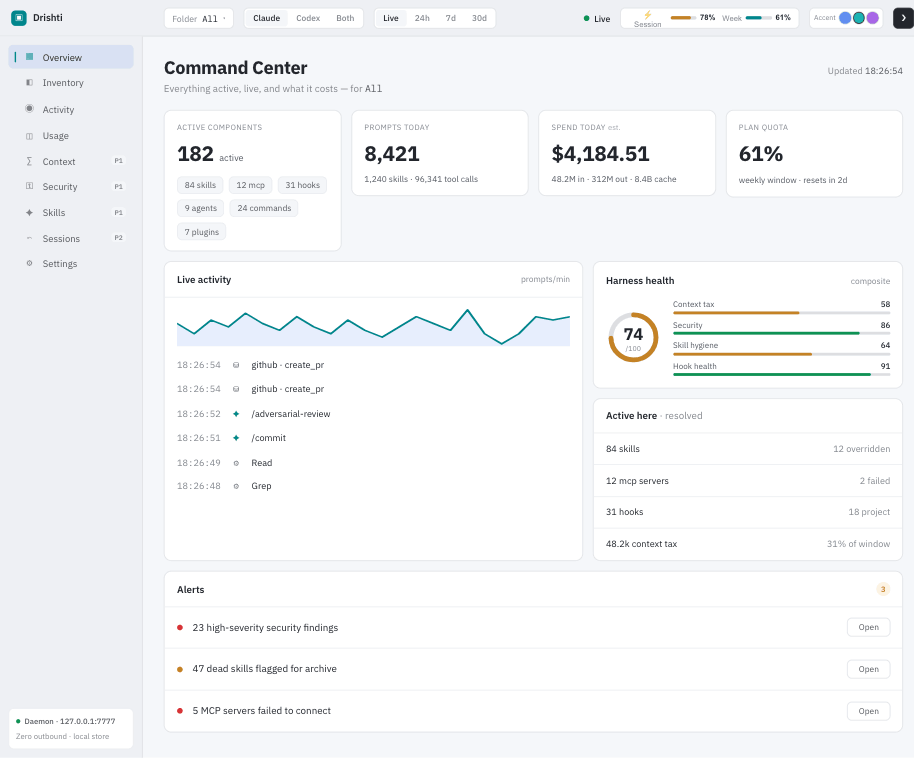

# Drishti — a local observability dashboard for Claude Code

**Drishti** (Sanskrit for *sight / vision*) is a fast, private, local dashboard that shows you
exactly what your [Claude Code](https://claude.com/claude-code) setup is doing: every skill, MCP
server, hook, and agent that's active, what you're spending, how much of your context window is
taxed before you type a word, and where your configuration might be unsafe.

It runs entirely on your machine, reads your Claude Code config **read-only**, and sends **no
telemetry**.



> **Status:** v1. Single-binary, single-user, local. Built for developers who want to understand
> and tune their Claude Code harness.

---

## Why Drishti

Claude Code is configured by layers of files — user settings, project settings, plugins, skills,
MCP servers, hooks, memory — that *merge and override* in ways that are hard to see. You can't
easily answer: *What's actually active right now? What is it costing me in tokens and dollars? Is
anything misconfigured or risky?*

Drishti answers those questions in one place, live.

## Features

- **Harness Map (Inventory)** — every active skill, MCP server, hook, agent, command, output-style,
  memory file, and plugin, resolved across user → project scope, with a "why is this active?"
  precedence trail.
- **Live Activity** — prompts, tool calls, skills, blocked actions, and errors streaming in real
  time over Server-Sent Events.
- **Usage & Cost** — token and dollar trends by day, project, and model; a usage heatmap and
  streak; optional plan-quota gauges.
- **Context Budget** — the always-on "context tax" of your active components, broken down by
  category, with an interactive "what if I disabled this?" recompute.
- **Security & Audit** — a configurable rule engine that flags risky settings (missing deny rules,
  bypass permission modes, overly broad allows, secrets in MCP env, untrusted plugin sources).
  Secret *values* are never read, stored, or displayed — only key names.
- **Skills Analytics** — which skills earn their always-on context cost, which are dead (never
  fired), and which over-trigger.
- **Overview (Command Center)** — real active-component counts, a 0–100 harness-health composite,
  a context-tax summary, and live alerts, all on one screen.
- **Settings** — tune watched folders, retention, appearance, and the rule files from the browser.

## Privacy & security model

Drishti is designed for a **single user on their own machine**:

- It reads `~/.claude` (and project configs) **read-only** and never modifies them.
- It writes **only** to its own `~/.drishti/` directory (database, config, rule files).
- The web UI binds to **`127.0.0.1` (loopback)** by default — it is not exposed to your network.
- It makes **zero outbound network calls**, except a single **opt-in** GitHub release check you
  must explicitly enable.
- Secret values found while scanning are detected and discarded at the parser boundary — only key
  names survive.

Because it's a single-user local tool, the API has no authentication. Run it on a machine you
control; don't expose the port to untrusted networks or shared hosts.

## Install

You need **Go 1.22 or newer**. The compiled web UI is committed to the repo, so you do **not** need
Node.js to build or run.

```bash
git clone https://github.com/saptarshi369/drishti.git
cd drishti
make run
```

`make run` builds the single binary (the SvelteKit UI is embedded via `go:embed`) and starts the
daemon. Then open:

```
http://127.0.0.1:7777
```

To build the binary without running it: `make build` (produces `./drishti`).

**Or install with Go** (once a release is tagged):

```bash
go install github.com/saptarshi369/drishti/cmd/drishti@latest
```

## Quick start

1. `make run`
2. Open `http://127.0.0.1:7777`.
3. Drishti scans your Claude Code configuration and transcripts and populates every screen live.

By default it watches your home directory. To focus on a specific project, configure watched roots
in Settings or `~/.drishti/config.toml` (see below), or launch from inside the project.

## Configuration

Drishti is configured from `~/.drishti/config.toml` (created on first run). You can edit it
directly or use the **Settings** screen. Common keys:

```toml
port      = 7777          # web UI port
bind_addr = "127.0.0.1"   # loopback by default

[roots]
paths = []                # folders to watch; empty = your home directory

[context]
window_tokens = 200000    # denominator for the context-tax percentage

[update]
auto_check = false        # opt-in: the only outbound network call
```

Two scan rule-sets are plain, fully-commented TOML files you can edit; Drishti reloads them within
~10 seconds, no restart needed:

- `~/.drishti/security-rules.toml` — the security-audit rules.
- `~/.drishti/skills-analytics.toml` — the dead / over-triggering thresholds.

See **[DETAILS.md](DETAILS.md)** for a full, screen-by-screen guide and every tuning option.

### Live plan-quota (optional)

To populate the Usage screen's plan-quota gauges, wire the bundled statusline helper into Claude
Code's `statusLine` setting (Drishti's Settings screen generates a copy-paste snippet; or see
`scripts/statusline-helper.sh`). Until installed, the gauges show an install prompt.

## How it works

A single Go daemon watches your Claude Code files, ingests transcripts incrementally into a local
SQLite database (pure-Go [modernc/sqlite](https://gitlab.com/cznic/sqlite), no CGO), derives the
views each screen needs, and serves an embedded SvelteKit UI that updates live over SSE.

**Stack:** Go · modernc SQLite · SvelteKit (static) · Server-Sent Events.

## Documentation

- **[DETAILS.md](DETAILS.md)** — what each screen shows, how to read it, and how to tune it.

## Roadmap

- Sessions & Replay — searchable history and turn-by-turn replay.
- Support for additional agent harnesses.

## Contributing

Issues and pull requests are welcome. The project builds and tests with:

```bash
make build   # compile
make test    # run the Go test suite
make lint    # golangci-lint
```

## License

[MIT](LICENSE) © Saptarshi Chakrabarty. Use it for anything you like; please keep the copyright and
license notice.
